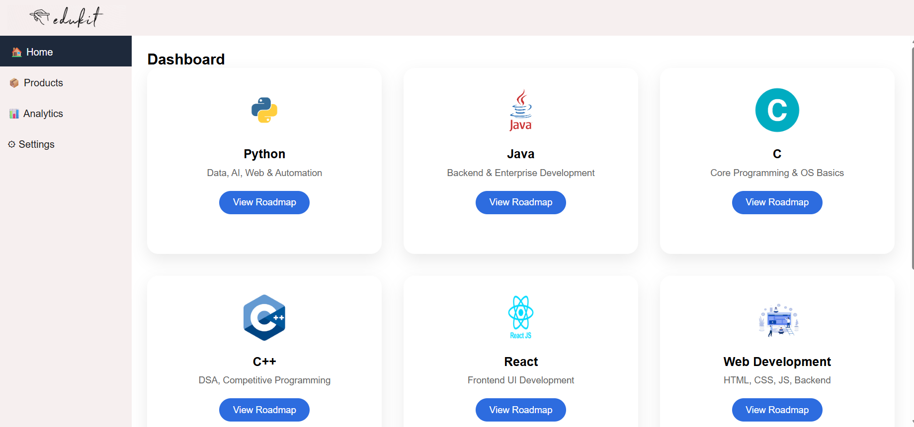
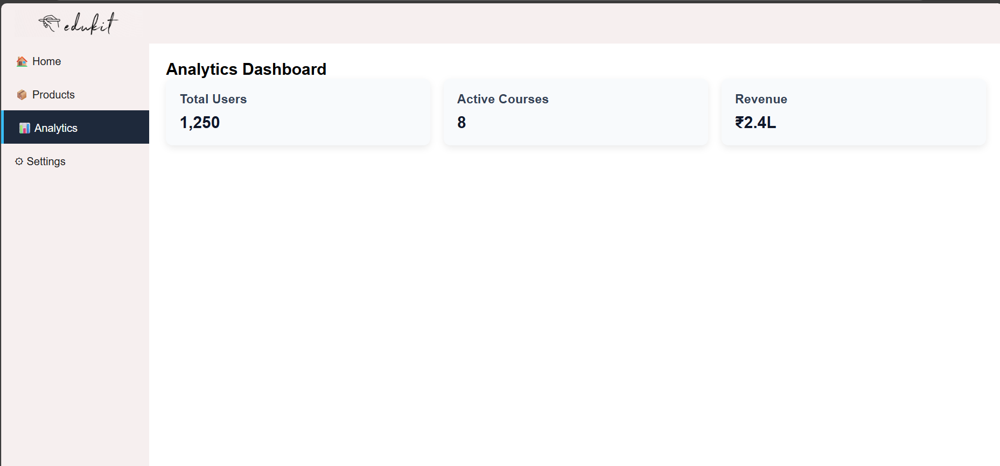
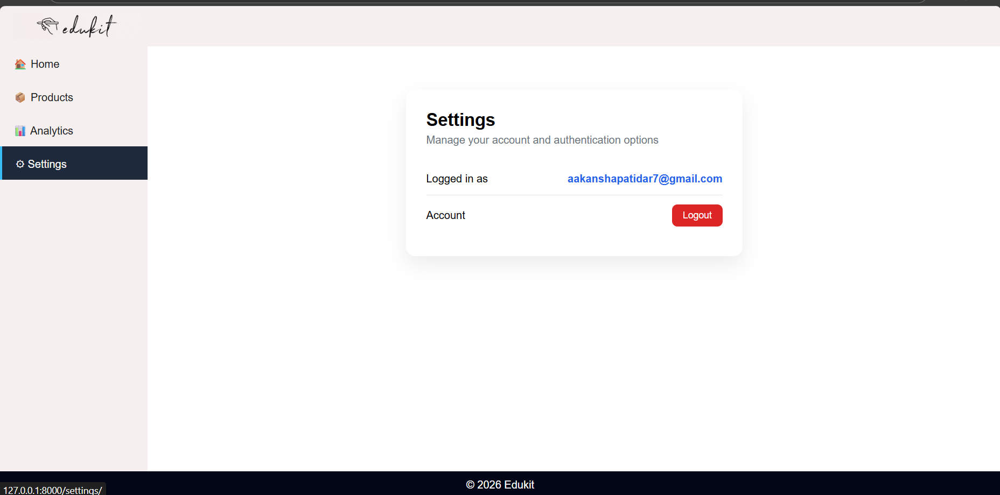

# Edukit 🎓

Edukit is a **Django-based learning roadmap platform** designed to help students and beginners follow structured learning paths across multiple technologies like **Python, Java, C, C++, Web Development, React, SQL, and R**.

The project focuses on **clean UI, clear learning roadmaps, user progress tracking, and basic analytics**, making it a strong beginner-to-intermediate level full-stack project suitable for resumes.

---

## Features

- 🔐 User Authentication (Login / Signup / Logout)
- 📚 Course-based Learning Roadmaps
- ✅ Step-wise Learning Flow
- 📊 Analytics Dashboard
- ⚙️ User Settings Page
- 🧭 Sidebar Navigation UI
- 🖥️ Responsive Dashboard Layout
- 🗂️ Product Listing for All Courses

---

## Tech Stack

- **Backend:** Django (Python)
- **Frontend:** HTML, CSS
- **Database:** SQLite (default Django DB)
- **Authentication:** Django Auth System

---

## Project Structure

```
edukit/
│
├── edukit/                  # Main project settings
│   ├── settings.py
│   ├── urls.py
│   └── wsgi.py
│
├── store/                   # Core application
│   ├── migrations/
│   ├── templates/
│   │   └── store/
│   │       ├── base.html
│   │       ├── dashboard.html
│   │       ├── products.html
│   │       ├── analytics.html
│   │       ├── settings.html
│   │       ├── signup.html
│   │       ├── login.html
│   │       ├── python.html
│   │       ├── java.html
│   │       ├── c.html
│   │       ├── cpp.html
│   │       ├── react.html
│   │       ├── web.html
│   │       ├── sql.html
│   │       └── r.html
│   │
│   ├── static/
│   │   ├── css/
│   │   │   └── style.css
│   │   └── images/
│   │   
│   │
│   ├── models.py
│   ├── views.py
│   ├── urls.py
│   └── admin.py
│
├── db.sqlite3
├── manage.py
└── README.md
```

## Screenshots

### Dashboard


### Products


### Analytics



### Settings



### Python Roadmap


### Java Roadmap


---

## Analytics Included

- Total Users
- Active Courses
- Revenue (Demo Data)

---

## Learning Outcomes

This project demonstrates:
- Django URL routing & views
- Template inheritance
- User authentication
- Database models & relationships
- Clean UI design
- Real-world project structuring

---


## Author

**Aakansha Patidar**  
  
🔗 GitHub: https://github.com/Aakanshapatidar  
🔗 LinkedIn: https://www.linkedin.com/in/aakansha-patidar-810031351/

---

 If you like this project, give it a star on GitHub!


